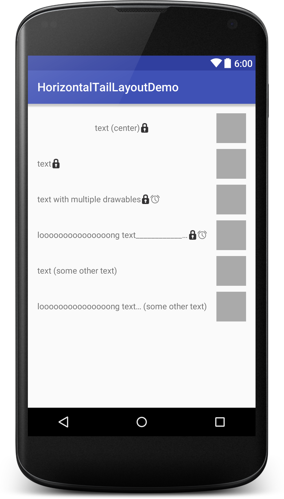

Android-HorizontalTailLayout
============================

A simple implementation of a custom layout which solves the issues of grouping a child view with its tailing views. 

One example is when right drawable used with `TextView`. To make sure text is ellipsized properly, we normally want to have `TextView` extend to match the full width of its parent view, but the drawable would end up showing in the right-most position though having a pretty short length of text. 

Another example is when you want to append another `TextView` after a length-felxible `TextView` i.e. showing group member count after group name. If group name is really long, we'll want to truncate the group name to leave room for member count. Otherwise we'll want member count to be right next to group name.

Unfortunately there is no straightforward way to implement this using built-in UI widgets.

#### What `HorizontalTailLayout` offers:
* smarter layout in general - guarantee that tailing views to follow closely when there is room for display, and squeeze only the first view otherwise
* supports 3 gravity modes: `center`, `center_horizontal`, `center_vertical`
* easy to use just like other built-in layouts



Usage
-----
```gradle
dependencies {
    compile 'com.github.bosphere.android-horizontaltaillayout:horizontaltaillayout:1.1.1'
}
```

```xml
<com.bosphere.horizontaltaillayout.HorizontalTailLayout
    android:layout_width="match_parent"
    android:layout_height="wrap_content"
    app:gravity="center_vertical">

    <TextView
        android:layout_width="wrap_content"
        android:layout_height="wrap_content"
        android:ellipsize="end"
        android:singleLine="true"
        android:includeFontPadding="false"
        android:text="text (center)"/>

    <ImageView
        android:layout_width="wrap_content"
        android:layout_height="wrap_content"
        android:src="@android:drawable/ic_secure"/>

</com.bosphere.horizontaltaillayout.HorizontalTailLayout>
```

Compatibility
-------------

API 7 (Android 2.1) and up

License
-------

Copyright 2015 Yang Bo

Licensed under the Apache License, Version 2.0 (the "License");
you may not use this file except in compliance with the License.
You may obtain a copy of the License at

   http://www.apache.org/licenses/LICENSE-2.0

Unless required by applicable law or agreed to in writing, software
distributed under the License is distributed on an "AS IS" BASIS,
WITHOUT WARRANTIES OR CONDITIONS OF ANY KIND, either express or implied.
See the License for the specific language governing permissions and
limitations under the License.
